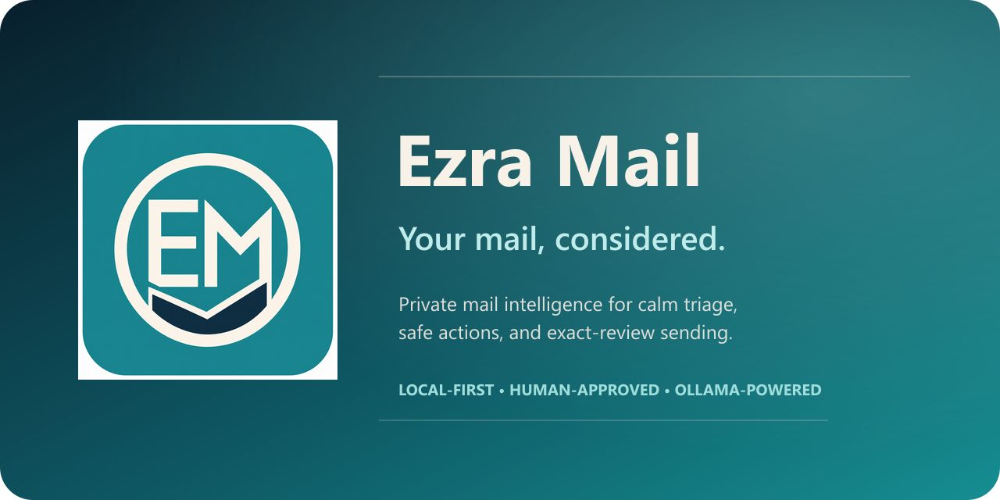
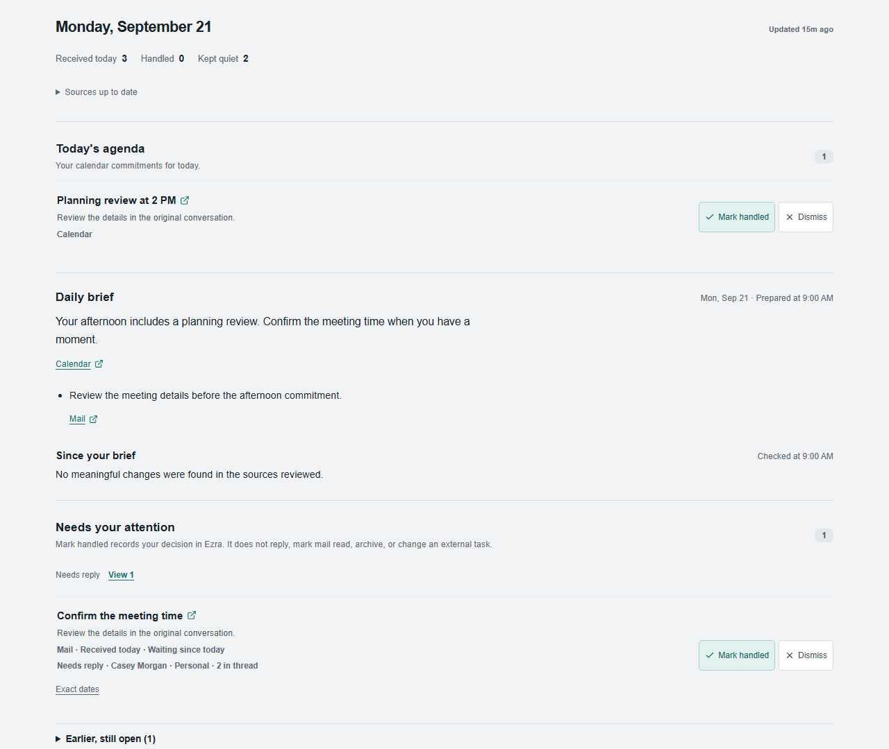
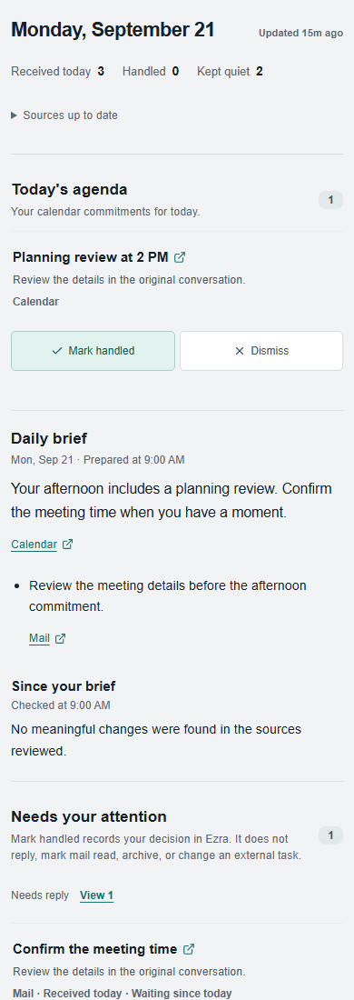

  

<h1 align="center">A different way to start with email.</h1>

  Your agenda, a daily brief, and the conversations that need you. 
  A personal project by <a href="https://github.com/R3dTh3Ging3r">Eric Mathews</a>.

  <a href="#a-look-inside">Take a look</a> ·
  <a href="#what-im-building">Features</a> ·
  <a href="docs/HOW_IT_WORKS.md">How it works</a> ·
  <a href="docs/PRIVACY.md">Privacy</a>

---

## Why I'm building it

I write code as a hobby. Ezra started with a fairly ordinary frustration: I wanted
my email to fit the way I work through a day. Outlook and Gmail already do a lot,
but I kept wishing the useful parts were presented a little differently.

So I started making my own interface. AI coding tools have helped me tackle more
of the project than I otherwise would have had time for. I've been using Ezra
with my personal accounts for a few months and improving it as I go.

The idea is simple: **help me see what's happening today, what needs a response,
and what can wait.**

## A look inside

*Preview of the Today component using fictional messages and calendar items.
This is a demonstration, not a live mailbox.*

<strong>See the same view on a smaller screen</strong>

 

This shows the responsive layout. Testing across real phones and installed clients
is still in progress.

## What I'm building

| Start with the day | Keep track of what matters |
| --- | --- |
| **Agenda first.** See today's calendar commitments alongside your email. | **Needs your attention.** Find conversations that need a decision, with received and waiting ages. |
| **A morning brief.** Get a short starting point for the day, with links back to the sources. | **Unfinished items stay visible.** Earlier items have their own place, so they don't disappear when the date changes. |
| **Since your brief.** See later developments separately, while keeping the morning snapshot intact. | **Worth knowing.** Keep useful information separate from things that call for action. |

Beyond Today, Ezra has mail and calendar views, separate account workspaces,
search, saved views, draft assistance, and an Outbox where I review the exact
message before sending it. Gmail and Microsoft accounts are supported, subject
to provider permissions and organization policies.

Optional notifications include browser alerts, Web Push, and Telegram. They're
configurable, with quiet hours and choices about how much detail is shown.

## How it fits together

**My email providers → my Ezra installation → my browser.**

Ezra is self-hosted: the installation stores synced email and calendar data, and
uses a configured local AI model for tasks such as summaries and triage. Mail
providers still handle the underlying accounts and delivery. Optional notification
channels involve their own services.

For the details, see [how it works, permissions, and data handling](docs/HOW_IT_WORKS.md).

## Where the project stands

Ezra is at **v0.8.2** and under active development. I use it with personal accounts;
there is still more work to do on device testing, installation, and everyday
usability. It is a personal project with no support SLA or promise of suitability
for business use.

This repository is the public introduction and policy reference. **The application
source is private**, and this page does not provide a hosted app or an installer.
Source access for a review can be arranged directly with me.

**Considering a work account?** Please check with your organization first. Personal
account use does not establish workplace approval. The
[technical overview](docs/HOW_IT_WORKS.md#work-account-review) explains the access
and setup an IT team may want to review.

---

[Privacy policy](docs/PRIVACY.md) · [Terms](docs/TERMS.md) · [License](LICENSE)

Made by Eric Mathews, one spare-time improvement at a time.
